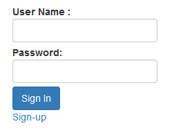
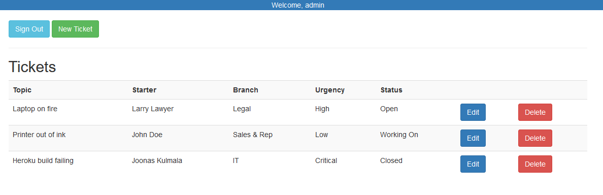
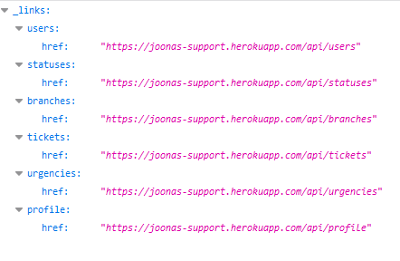

# Support Ticket App | Joonas Kulmala

- [Support Ticket App | Joonas Kulmala](#support-ticket-app--joonas-kulmala)
  - [Project description](#project-description)
  - [Requirements](#requirements)
  - [Features](#features)
    - [Authentication](#authentication)
    - [CRUD functionality](#crud-functionality)
    - [REST API](#rest-api)
  - [License](#license)

## Project description

Palvelinohjelmointi - SWD4TN020

***Live Build*** deployed via [Heroku - joonas.support](https://joonas-support.herokuapp.com)

## Requirements

`Java 11` is required to run this application.

Run the main application file [PalvelinohjelmointiApplication.java](src/main/java/fi/kulmala/support/PalvelinohjelmointiApplication.java) and open browser at port 8080

    localhost:8080

## Features

### Authentication

Two users are initialized on application startup:

- user/user (role=user)
- admin/admin (role=admin)

Application has the following authentication services:

- registration
- login

<kbd>
  
</kbd>

### CRUD functionality

Navigate to main view

    localhost:8080/support

<kbd>
  
</kbd>

### REST API

> Please note that users' hashed passwords are visible through /api/users for demo purposes. This would probably not work in production, though.

Rest API endpoints are available at

    localhost:8080/api

<kbd>
  
</kbd>

## License

Repository and all its contents distributed under [MIT](LICENSE) license.